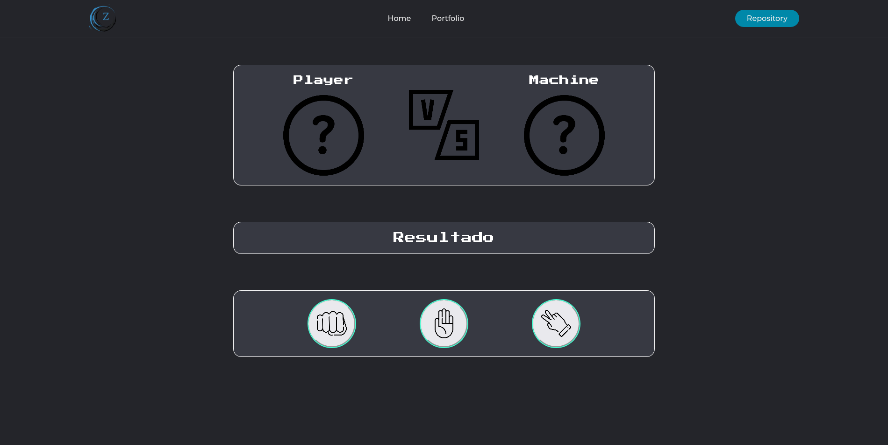
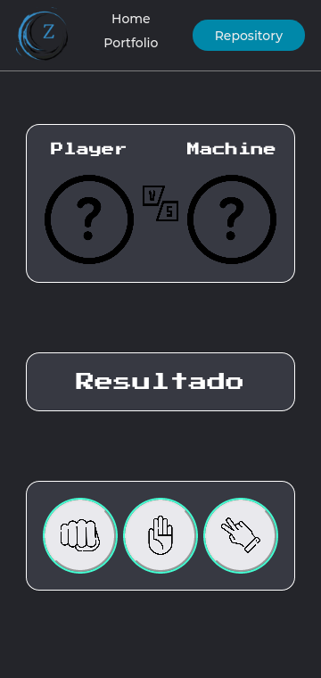

# Rock Paper Scissors
Esta es una pagina web en donde se realiza el juego Piedra, Papel, Tijeras. Creada para dar continuación del curso de JavaScript Básico de Platzi y asi afianzar términos básicos del lenguaje.

 

## Características ##

Dentro del curso se implementan varias características de HTML, CSS y JavaScript como:

* Manejo y manipulación del DOM a traves de JavaScript.

* Gestión de eventos a traves de JavaScript para agregar interactividad.

* Uso de Funciones, Variables, condicionales y operaciones lógicas para gestionar la lógica detrás del juego.

* Asignación de clases CSS para agregar o remover estilos a partir de la activación de eventos escuchados desde JavaScript.

* Uso de etiquetas HTML especializadas al las vistas responsive como el meta viewport de HTML5.

* Uso de Grid Layout.

* Uso de Normalize.css para reincio de estilos de manera rápida y sencilla.

* Uso de Displays enfocándose en el display flex-box para dar una alineación horizontal a los elementos y tengan propiedades responsive con el tamaño de la pagina.

* Uso de MediaQueries para el control Responsive de la página web en otras pantallas.

 

## Resultado ##

A continuación se muestra el resultado del juego Piedra Papel o Tijera, si desea ver la pagina, puede entrar a el con un [Click acá](https://zerobl21.github.io/RockPaperScissors/ "RockPaperScissors").

 

## Desktop ##

## Mobile ##

